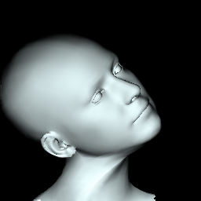

## 目的
## 安装依赖
```bash
cd mesh/cython
python setup.py build_ext -i 
```
## 运行
1. 下载flame 人头模型，并设置
```python
flame_model_path = '../flame_head_model/FLAME2020/generic_model.pkl'
```
2. 渲染人头

```python
python render_flame_head_model.py
```

可以得到一个渲染后的人头模型



flame人头模型有几个参数可以调整：
```python
pose_params_numpy = np.array([[0, 0, 0.0, 0.0, 0, 0],
                                ], dtype=np.float32)
```
前三个参数为人头的pitch，yaw，roll控制参数，第4个为张嘴的参数jaw。
参考链接：
[face3d](git://github.com/YadiraF/face3d.git)